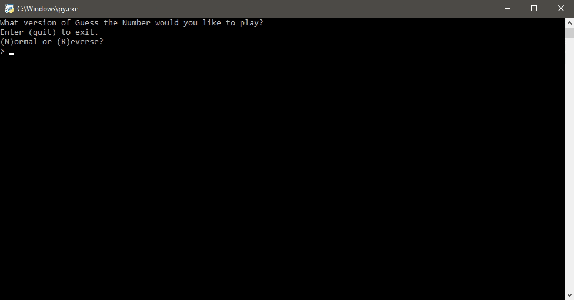

# Guess the Number
A simple number guessing game. I have made two ways of playing this game, Normal and Reverse. See [Gameplay](#Gameplay) for details.

## Table of Contents
- [Gameplay](#Gameplay)
    - [Normal](#Normal)
    - [Reverse](#Reverse)
- [Built With](#Built-With)
- [Running the Game](#Running-the-Game)
- [License](#License)
- [Donations (Optional)](#Donations-(Optional))

## Gameplay
There are two ways of playing this game, [Normal](#Normal) and [Reverse](#Reverse). Both are number guessing games, the difference is who's guessing.

### Normal
In this mode, the computer will randomly choose a secret number. The secret number will be in a random range of 10-100, this means that some games will be easier or harder than the previous. Example, your first game could be guessing between '1 and 20', your next game could be between '1 and 50' or '1 and 10', and etc. You will have 6 tries to guess the secret number each time.

### Reverse
The roles are reversed this time. You get to choose the secret number from a range of 1-50. You do not give the computer your number at any point. See if the computer can guess it in 6 tries.

## Built With
- [Python 3.8](python.org) with the help of the built-in modules:
    - os
    - random
    - sys

## Running the Game
- Install Python 3.6 or newer.
    - You can grab the latest copy from http://python.org.
- Download the `guess_num.py`.
- Run `guess_num.py`
    - Follow the prompts on-screen
    - Enjoy!

## License 
Distributed under the MIT License. See `LICENSE` for more information.

## Donations (Optional)
Ko-fi is basically a virtual tip jar where you can support creatives for about the price of a cup of coffee.

At this time, I'm not very active on Ko-fi nor do I offer any rewards. If you love my work and feel like supporting me, hit the button below to get started.

Tipping is optional but I will appreciate any amount you choose to donate. Thank you (´• ω •`) ♡ !

